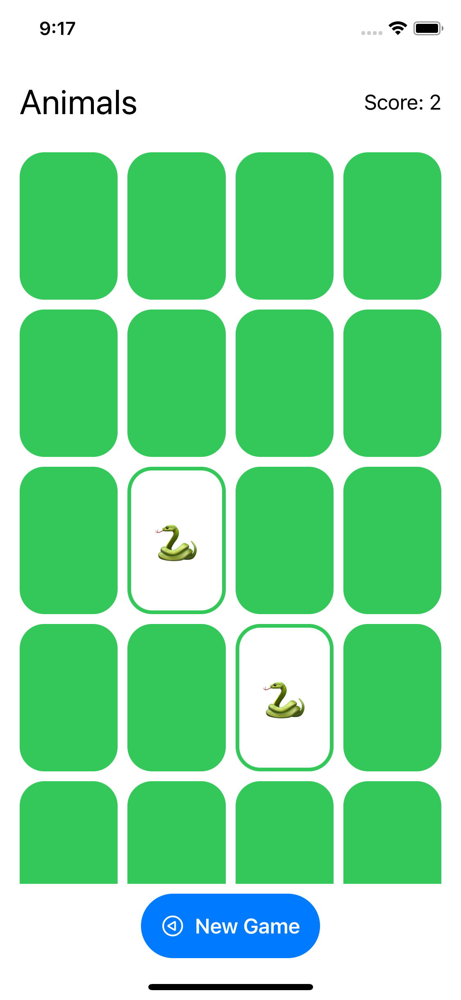

# Memorize21

This is a work in progress learning project for my personal endeavours of becoming an iOS Developer one day.
Memorize is a [Memory Game](https://en.wikipedia.org/wiki/Matching_game) and runs on iOS and iPadOS (version >=14).



## Tech Stack
- [Xcode 13.0](https://developer.apple.com/xcode/)
- [Swift 5.5](https://swift.org/)
- [SwiftUI](https://developer.apple.com/xcode/swiftui/)

## Used Tools
- [SwiftLint](https://github.com/realm/SwiftLint)

## Architectural Design Patterns
- [MVVM](https://matteomanferdini.com/mvvm-pattern-ios-swift/)

## Code comments
If you have the time to look at my code, you will notice an unusual amount of additional code comments which I have put along the lines. These comments are for my own learning and documentation purposes and probably would not appear in such a way in production code.

## App Store
This App is available on the [App Store](https://www.apple.com/app-store/), ready and free to be installed on your personal iPhone or iPad 😉

## Beta Testing using TestFlight
Past and upcoming beta versions of my App are available for Testing on [TestFlight](https://testflight.apple.com/)! DM me on [Twitter](https://twitter.com/simonbernerdev) and I will send you an invite 🙂

## Feature Requests & Bugs
Feature Request and Bugs can be reported by opening a [new issue](https://github.com/simonberner/memorize21/issues). I might have a look at them 😁

## Learnings
### SwiftUI
- [Kickstart](https://matteomanferdini.com/swiftui/)
### MVVM
- MVVM helps you to respect the separation of concerns design principle
#### View
- Is completely decoupled from the Model
- Is reactive and always reflects the current state of the model
- (The struct) Is created and thrown away all the time. Only the 'var body' sticks around for a very long time
- Don't need any state of their own
- Supposed to be "stateless" and drawing what the current state of the Model is
- Is a Self-referencing protocol and cannot be used as a normal type
- Use @State purposely and sparingly
- @State is a "source of truth" so it is better not something which belongs to the Model
- @State is only used to give temporary state to a var
- @State vars are marked private because no one else can access them anyway
- @State var will cause the View to rebuild its body anytime the data where the @State var is pointing to, changes.
(This is like an @ObservedObject but on a random piece of data (instead of a ViewModel).)
In the new version of the body, the @State var will continue to point the the data in the heap.
- @State makes a space for the var in the heap because the View struct is read-only
#### ViewModel
- Interoperates the Model for the View
#### Model
- The model layer is the foundation of an app's architecture. 
- Holds the permanent state of the app
### Gradient
- [SwiftUI has a built-in way to apply gradient color](https://sarunw.com/posts/gradient-in-swiftui/)
### Dates
- [Date](https://developer.apple.com/documentation/foundation/date)
- [Working with dates](https://www.hackingwithswift.com/books/ios-swiftui/working-with-dates)
- [Dates, DateComponents and Formatting](https://learnappmaking.com/swift-date-datecomponents-dateformatter-how-to/)
- [Dates in Swift](https://medium.com/codex/working-with-dates-in-swift-9f50390bbc81)
### Access Control
- [Swift Access Control](https://docs.swift.org/swift-book/LanguageGuide/AccessControl.html)
- Make things private by default and change them afterwards when you see that you need to access them from other place in your code
- internal (this is default): it can be accessed from anywhere in your code
### @escaping
- [Escaping Closures](https://docs.swift.org/swift-book/LanguageGuide/Closures.html#ID546)
- [What is @escaping in Swift?](https://www.donnywals.com/what-is-escaping-in-swift/#:~:text=In%20short%2C%20%40escaping%20is%20used,compiler%20that%20this%20is%20intentional.)
### Shape
- All shapes are also Views, they inherit from the View protocol
- [SwiftUI Doc with examples](https://swiftontap.com/shape)
- [Built-in shapes](https://www.hackingwithswift.com/quick-start/swiftui/swiftuis-built-in-shapes)
- The func fill() is a generic function where the 'S' is a don't care (but since there's a 'where S: ShapeStyle', it becomes a "care a little bit").
### Markdown comments
- [How to add Markdown comments to your code](https://www.hackingwithswift.com/example-code/language/how-to-add-markdown-comments-to-your-code)
- [Documentation Comment Syntax](https://github.com/apple/swift/blob/main/docs/DocumentationComments.md)
### Property Wrapper
- [What is it?](https://docs.swift.org/swift-book/LanguageGuide/Properties.html#ID617)
- [SwiftUI property wrappers](https://www.hackingwithswift.com/quick-start/swiftui/all-swiftui-property-wrappers-explained-and-compared)
## View Modifier
- [Z index](https://www.hackingwithswift.com/quick-start/swiftui/how-to-change-the-order-of-view-layering-using-z-index)
### Animation
- Only changes can be animated. This includes the following three things:
    - ViewModifier arguments
    - Shapes
    - The comings and goings (existence or not) of Views in the UI
- Animation is showing the user changes that have already happened
- [How to create simple animations](https://steelkiwi.com/blog/how-to-create-simple-swiftui-animations/)
- Implicit Animations
    - Less important kinds of animation
    -  Golden rule: only animates view modifiers for views which are already on screen
    - View that are coming on screen or going of screen, can be animated with the .transition modifier
    - All ViewModifier arguments that precede the animation modifier will always be animated.
    - Eg. whenever scary and upsideDown changes, the opacity/rotationEffect will be animated:
    - Without .animation(), the changes to opacity/rotation would appear instantly (not animated) on screen.
    - Important: ViewModifiers after the animation modifier, will NOT be animated!
    - .animation modifier does not work on containers

```swift
Text("Hello World")
    .opacity(scary ? 1 : 0)
    .rotationEffect(Angle.degrees(upsideDown ? 180 : 0))
    .animation(Animation.easeInOut)
```

- Explicit Animations
    - Is much more of a common way of doing animations
    - Are independent of implicit animations when used in combination
    - Only animates shapes and view modifiers
    - Are used for user 'intent functions'
    - We don't attach a modifier to a view, instead we ask SwiftUI to animate the precise change we want to make.
- Transitions
    - A transition determines how a view appears/disappears on the screen.
    - Transitions have their own animations: Transition.scale.animation()
    - Are good for making the comings and goings of views looking smooth
    - There are about 4 precanned transitions which are used the most
    - AnyTransition is a typed erased transition
    - [Advanced Transitions](https://swiftui-lab.com/advanced-transitions/)
- References:
    - [How to create an explicit animation](https://www.hackingwithswift.com/quick-start/swiftui/how-to-create-an-explicit-animation)
    - [Implicit and explicit animations](https://sirkif.hashnode.dev/explore-animation-in-swiftui-part-1)
    - [Basic Animations and Transitions](https://www.appcoda.com/learnswiftui/swiftui-animation.html)
### Text and Images
- [How to insert images into text](https://www.hackingwithswift.com/quick-start/swiftui/how-to-insert-images-into-text)
### Tools
- [Integrate SwiftLint into your Xcode project](https://github.com/realm/SwiftLint#xcode)
    - [Docs](https://realm.github.io/SwiftLint/)
    - [Configuration](https://github.com/realm/SwiftLint/#configuration)
    - [How to clean up your code formatting with SwiftLint](https://www.hackingwithswift.com/articles/97/how-to-clean-up-your-code-formatting-with-swiftlint)
    - [SwiftLint for Swift Packages](https://blog.timac.org/2021/1003-swiftlint-for-swift-packages/)
### TestFlight
- [Sean Allen: How to upload and distribute an App](https://www.youtube.com/watch?v=DLvdZtTAJrE)
### Versioning
- [Intro to Semantic Versioning](https://www.geeksforgeeks.org/introduction-semantic-versioning/)
- [Semantic Versioning 2.0.0](https://semver.org/)
