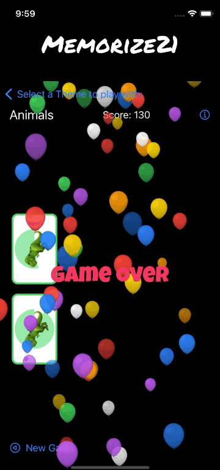

<h1 align=center>Memorize21</h1>

Memorize21 is a classical [Memory Game](https://en.wikipedia.org/wiki/Matching_game) and is my very first iOS Development learning project.

<p align="center">
    <a href="https://en.wikipedia.org/wiki/IOS">
        
    </a>
    <a href="https://en.wikipedia.org/wiki/IPadOS">
        
    </a>
    <a href="https://www.swift.org/">
        
    </a>
    <a href="https://developer.apple.com/xcode/swiftui">
        
    </a>
    <a href="https://developer.apple.com/xcode">
        
    </a>
    <a href="https://mastodon.green/@simonberner">
        
    </a>
    <a href="https://gitmoji.dev">
        
    </a>
    <a href="https://github.com/conventional-commits/conventionalcommits.org">
        
    </a>
    <a href="https://opensource.org/licenses/MIT">
        
    </a>
</p>

---

## Contents
* [Compatibility](#compatibility)
* [Screens](#screens)
* [Tech Stack](#tech-stack)
* [Used Tools](#used-tools)
* [Architecture](#architecture)
* [Code comments](#code-comments)
* [App Store](#app-store)
* [Learning Journey](#learning-journey)
* [Fastlane](#fastlane)
* [Release Notes](#release-notes)
* [Contribution Guidelines](#contribution-guidelines)

---

## Compatibility
- As of version 3 of the App, only iOS/iPadOS 16.2+ are supported!

## Screens



## Tech Stack
- [Xcode 14.2](https://developer.apple.com/xcode/)
- [Swift 5.7.2](https://swift.org/)
- [SwiftUI](https://developer.apple.com/xcode/swiftui/)

## Used Tools
- [SwiftLint](https://github.com/realm/SwiftLint)

## Architecture
### Architectural Design Pattern
- [MVVM](https://matteomanferdini.com/mvvm-pattern-ios-swift/)

## Code comments
If you have the time to look at my code, you will notice an unusual amount of additional code comments which I have put along the lines. These comments are for my own learning and documentation purposes and probably would not appear in such a way in production code.

## App Store
This App is available on the [App Store](https://apps.apple.com/app/memorize21/id1587918694), ready and free to be installed on your personal iPhone or iPad 😉

## Beta Testing using TestFlight
Past and upcoming beta versions of my App are available for Testing on [TestFlight](https://testflight.apple.com/)! DM me on [Twitter](https://twitter.com/simonbernerdev) if you want to test an upcoming release and I will send you an invite.

## Feature Requests & Bugs
Feature Request and Bugs can be reported by opening a [new issue](https://github.com/simonberner/memorize21/issues). I might have a look at them 😁

## Learning Journey
I am reflecting my whole iOS Development learning journey in one giant XMind MindMap. Rather than day by day journal entries, you will find all the different topics I have faced on my way so far. You will find the MindMap in this repo 😉
### SwiftUI
- [Kickstart](https://matteomanferdini.com/swiftui/)
### MVVM
- MVVM helps you to respect the separation of concerns design principle
#### View
- Is completely decoupled from the Model
- Is reactive and always reflects the current state of the model
- (The struct) Is created and thrown away all the time. Only the 'var body' sticks around for a very long time
- Don't need any state of their own
- Supposed to be "stateless" and drawing what the current state of the Model is
- Is a Self-referencing protocol and cannot be used as a normal type
- Use @State purposely and sparingly
- @State is a "source of truth" so it is better not something which belongs to the Model
- @State is only used to give temporary state to a var
- @State vars are marked private because no one else can access them anyway
- @State var will cause the View to rebuild its body anytime the data where the @State var is pointing to, changes.
(This is like an @ObservedObject but on a random piece of data (instead of a ViewModel).)
In the new version of the body, the @State var will continue to point the the data in the heap.
- @State makes a space for the var in the heap because the View struct is read-only
#### ViewModel
- Interoperates the Model for the View
#### Model
- The model layer is the foundation of an app's architecture. 
- Holds the permanent state of the app
### Gradient
- [SwiftUI has a built-in way to apply gradient color](https://sarunw.com/posts/gradient-in-swiftui/)
### Dates
- [Date](https://developer.apple.com/documentation/foundation/date)
- [Working with dates](https://www.hackingwithswift.com/books/ios-swiftui/working-with-dates)
- [Dates, DateComponents and Formatting](https://learnappmaking.com/swift-date-datecomponents-dateformatter-how-to/)
- [Dates in Swift](https://medium.com/codex/working-with-dates-in-swift-9f50390bbc81)
### Access Control
- [Swift Access Control](https://docs.swift.org/swift-book/LanguageGuide/AccessControl.html)
- Make things private by default and change them afterwards when you see that you need to access them from other place in your code
- internal (this is default): it can be accessed from anywhere in your code
### @escaping
- [Escaping Closures](https://docs.swift.org/swift-book/LanguageGuide/Closures.html#ID546)
- [What is @escaping in Swift?](https://www.donnywals.com/what-is-escaping-in-swift/#:~:text=In%20short%2C%20%40escaping%20is%20used,compiler%20that%20this%20is%20intentional.)
### Shape
- All shapes are also Views, they inherit from the View protocol
- [SwiftUI Doc with examples](https://swiftontap.com/shape)
- [Built-in shapes](https://www.hackingwithswift.com/quick-start/swiftui/swiftuis-built-in-shapes)
- The func fill() is a generic function where the 'S' is a don't care (but since there's a 'where S: ShapeStyle', it becomes a "care a little bit").
### Markdown comments
- [How to add Markdown comments to your code](https://www.hackingwithswift.com/example-code/language/how-to-add-markdown-comments-to-your-code)
- [Documentation Comment Syntax](https://github.com/apple/swift/blob/main/docs/DocumentationComments.md)
### Property Wrapper
- [What is it?](https://docs.swift.org/swift-book/LanguageGuide/Properties.html#ID617)
- [SwiftUI property wrappers](https://www.hackingwithswift.com/quick-start/swiftui/all-swiftui-property-wrappers-explained-and-compared)
## View Modifier
- [Z index](https://www.hackingwithswift.com/quick-start/swiftui/how-to-change-the-order-of-view-layering-using-z-index)
### Animation
- Only changes can be animated. This includes the following three things:
    - ViewModifier arguments
    - Shapes
    - The comings and goings (existence or not) of Views in the UI
- Animation is showing the user changes that have already happened
- [How to create simple animations](https://steelkiwi.com/blog/how-to-create-simple-swiftui-animations/)
- Implicit Animations
    - Less important kinds of animation
    -  Golden rule: only animates view modifiers for views which are already on screen
    - View that are coming on screen or going of screen, can be animated with the .transition modifier
    - All ViewModifier arguments that precede the animation modifier will always be animated.
    - Eg. whenever scary and upsideDown changes, the opacity/rotationEffect will be animated:
    - Without .animation(), the changes to opacity/rotation would appear instantly (not animated) on screen.
    - Important: ViewModifiers after the animation modifier, will NOT be animated!
    - .animation modifier does not work on containers

```swift
Text("Hello World")
    .opacity(scary ? 1 : 0)
    .rotationEffect(Angle.degrees(upsideDown ? 180 : 0))
    .animation(Animation.easeInOut)
```

- Explicit Animations
    - Is much more of a common way of doing animations
    - Are independent of implicit animations when used in combination
    - Only animates shapes and view modifiers
    - Are used for user 'intent functions'
    - We don't attach a modifier to a view, instead we ask SwiftUI to animate the precise change we want to make.
- Transitions
    - A transition determines how a view appears/disappears on the screen.
    - Transitions have their own animations: Transition.scale.animation()
    - Are good for making the comings and goings of views looking smooth
    - There are about 4 precanned transitions which are used the most
    - AnyTransition is a typed erased transition
    - [Advanced Transitions](https://swiftui-lab.com/advanced-transitions/)
- References:
    - [How to create an explicit animation](https://www.hackingwithswift.com/quick-start/swiftui/how-to-create-an-explicit-animation)
    - [Implicit and explicit animations](https://sirkif.hashnode.dev/explore-animation-in-swiftui-part-1)
    - [Basic Animations and Transitions](https://www.appcoda.com/learnswiftui/swiftui-animation.html)
### Property Observers
- [Property observers in Swift](https://www.hackingwithswift.com/sixty/7/3/property-observers)
### @State and @Binding
- [SwiftUI: “@State” and “@Binding”](https://medium.com/if-let-swift-programming/swiftui-state-and-binding-5d45ed33f323)
- [Reactive Programming with Bindings](https://learnappmaking.com/binding-swiftui-how-to/)
### Text and Images
- [How to insert images into text](https://www.hackingwithswift.com/quick-start/swiftui/how-to-insert-images-into-text)
### NavigationView
- [The Complete Guide to NavigationView in SwiftUI](https://www.hackingwithswift.com/articles/216/complete-guide-to-navigationview-in-swiftui)
### Fonts
- The system default font of a Text is: San Francisco
- Have a look at [Google Fonts](https://fonts.google.com/) for choosing your custom fonts
- For adding custom fonts in SwiftUI have a look at: [How to add custom fonts in SwiftUI](https://betterprogramming.pub/custom-fonts-in-swiftui-d529de69131d)
### Tools
- [Integrate SwiftLint into your Xcode project](https://github.com/realm/SwiftLint#xcode)
    - [Docs](https://realm.github.io/SwiftLint/)
    - [Configuration](https://github.com/realm/SwiftLint/#configuration)
    - [How to clean up your code formatting with SwiftLint](https://www.hackingwithswift.com/articles/97/how-to-clean-up-your-code-formatting-with-swiftlint)
    - [SwiftLint for Swift Packages](https://blog.timac.org/2021/1003-swiftlint-for-swift-packages/)
### TestFlight
- [Sean Allen: How to upload and distribute an App](https://www.youtube.com/watch?v=DLvdZtTAJrE)
- [Are you an App Store developer who is tired of clicking through the "compliance" question every time you submit a build?](https://twitter.com/danielpunkass/status/1517507834778370049)
- [Complying with Encryption Export Regulations](https://developer.apple.com/documentation/security/complying_with_encryption_export_regulations)
- [Automating the encryption compliance check](https://developer.apple.com/documentation/bundleresources/information_property_list/itsappusesnonexemptencryption)
### Versioning
- [Intro to Semantic Versioning](https://www.geeksforgeeks.org/introduction-semantic-versioning/)
- [Semantic Versioning 2.0.0](https://semver.org/)

## Fastlane
The fastest steps which I took to setup fastlane for this project were the following:
1. Install fastlane: ```brew install fastlane```
2. In the project directory: ``fastlane init``` and follow the instructions
(Don't use 'fastlane init swift' yet, as it is still in beta and just creates a mess at the moment.
See also https://docs.fastlane.tools/getting-started/ios/fastlane-swift/)
3. Have a look at my [Ruby file](Memorize21/fastlane/Fasfile)
4. Create an App specific password in your Apple account: https://appleid.apple.com/account/manage -> Security
5. Run lanes with e.g: ```fastlane beta```
### Troubleshooting
- In case that you run out of 'Distribution' certificates, check the Certificates section in your Apple Developer account and delete unused certificates.

## Release notes
### v3.0.0
- INFO: this version runs only on iOS 16.2+
- NEW: bottom sheet for the info view
- NEW: NavigationStack
- DOC: some updates
- FIXED: small fixes

## Contribution Guidelines
### Unit-Testing
Follow the [Arrange, Act and Assert Pattern](https://automationpanda.com/2020/07/07/arrange-act-assert-a-pattern-for-writing-good-tests/) for Unit Testing.
- Arrange inputs and targets:
    - Does the test require any objects or special settings?
    - Does it need to prep a database?
    - Does it need to log into a web app?
- Act on target behavior:
    - This step should call the function/method/API, or whatever needs to be tested.
    - It should focus on the target behavior.
- Assert expected outcomes:
    - This step should elicit some sort of response.
    - Then the response should be judged for correctness.
### UI-Testing
Follow the [Given-When-Then style](https://martinfowler.com/bliki/GivenWhenThen.html) to write the UI-Tests from a user perspective.
### Code Comments
- Include "[self documenting code](https://www.youtube.com/watch?v=1NEa-OcsTow)."
- Additionally, include descriptive comments in order to improve readability.
    -Aim for comments that allow other programmers to understand your code without having to work through your entire classes/methods.
### Pull Requests
- Pull requests should be kept to a reasonable size.
- Pull requests should be descriptive, answer the following questions:
    - What was the problem?
    - What did you do to improve it?
    - How do you know it is a working solution?/What tests did you do?
    - Why do you believe this is the right solution?
    - Why is this the best solution for the problem?
- Review/proofread your pull request before submission.
Following this [guide](https://www.youtube.com/watch?v=_sfzAOfY8uc).

## Extra: Xcode shortcuts
- CMD + B: build the project
- CMD + R: build and run the App in the simulator
- CMD + SHIFT + K: clean build folder
- CMD + SHIFT + O: open quick search
- CMD + SHIFT + J: highlight the selected open file in the navigator
- CMD + SHIFT + L: open up the library (Snippets, Media, Colors, SF Symbols)

<hr>
<p align="center">
Made with a 🙂 <a href="https://simonberner.dev">Simon Berner
</p>
