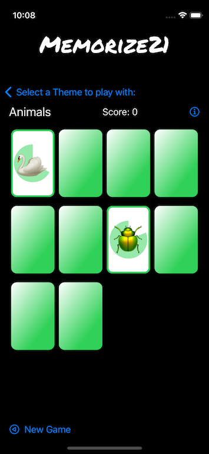

# Memorize 2021

This is a work in progress learning project for my personal endeavours of becoming an iOS Developer one day.
Memorize is a [Memory Game](https://en.wikipedia.org/wiki/Matching_game) and runs on iOS and iPadOS (version >=14). Its purpose is to practice the MVVM paradigm, Swift and SwiftUI.

## Tech Stack
- Xcode 12.5.1
- Swift 5.4
- SwiftUI 

## Learnings
### MVVM
#### View
- Is completely decoupled from the Model
- Is reactive and always reflects the current state of the model
- (The struct) Is created and thrown away all the time. Only the 'var body' sticks around for a very long time
- Don't need any state of their own
- Supposed to be "stateless" and drawing what the current state of the Model is
- Use @State purposely and sparingly
- @State is a "source of truth" so it is better not something which belongs to the Model
- @State is only used to give temporary state to a var
- @State vars are marked private because no one else can access them anyway
- @State var will cause the View to rebuild its body anytime the data where the @State var is pointing to, changes.
(This is like an @ObservedObject but on a random piece of data (instead of a ViewModel).)
In the new version of the body, the @State var will continue to point the the data in the heap.
- @State makes a space for the var in the heap because the View struct is read-only
#### ViewModel
- Interoperates the Model for the View
#### Model
- Holds the permanent state of the app
### Gradient
- [SwiftUI has a built-in way to apply gradient color](https://sarunw.com/posts/gradient-in-swiftui/)
### Dates
- [Date](https://developer.apple.com/documentation/foundation/date)
- [Working with dates](https://www.hackingwithswift.com/books/ios-swiftui/working-with-dates)
- [Dates, DateComponents and Formatting](https://learnappmaking.com/swift-date-datecomponents-dateformatter-how-to/)
- [Dates in Swift](https://medium.com/codex/working-with-dates-in-swift-9f50390bbc81)
### [Access Control](https://docs.swift.org/swift-book/LanguageGuide/AccessControl.html)
- Make things private by default and change them afterwards when you see that you need to access them from other place in your code
- internal (this is default): it can be accessed from anywhere in your code
